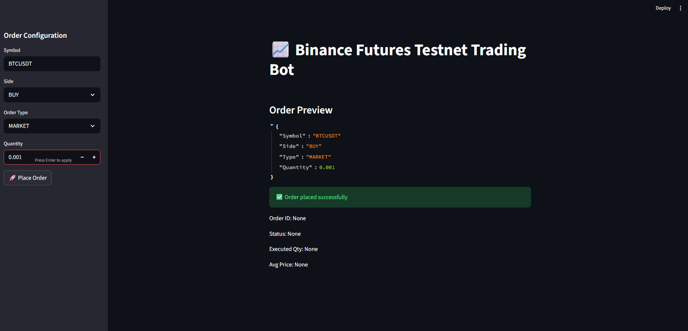
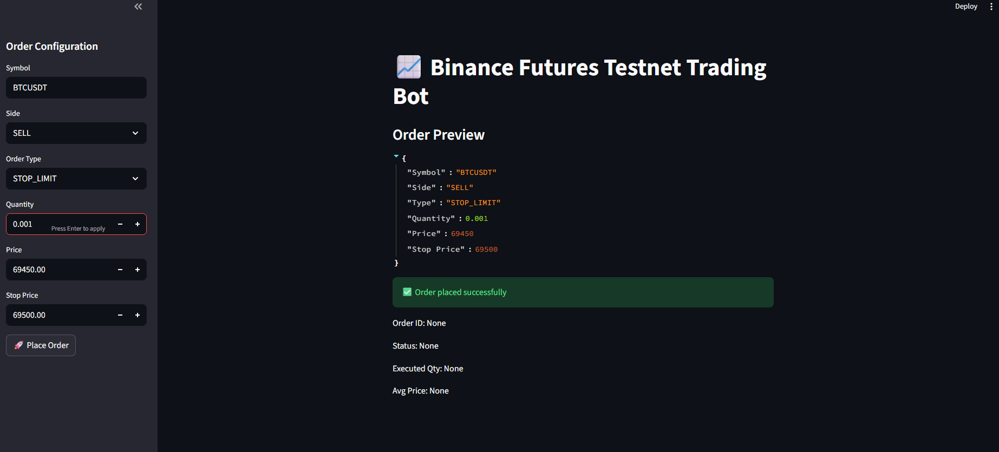
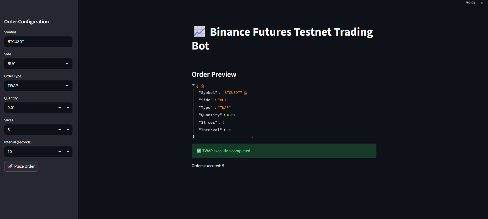

# Binance Futures Testnet Trading Bot

A Python-based trading bot with a Streamlit UI for placing and managing orders on the Binance Futures Testnet (USDT-M).

---

## Features

- MARKET, LIMIT, STOP-LIMIT orders
- TWAP (Time-Weighted Average Price) strategy
- BUY / SELL support
- Input validation and error handling
- Centralized logging
- Binance Futures Testnet compatible

---

## Project Structure
```
├── bot/
│ ├── client.py
│ ├── orders.py
│ ├── validators.py
│ ├── logging_config.py
│ ├── twap.py
│ └── init.py
├── app.py
├── requirements.txt
├── README.md
├── logs/
│ └── trading_bot.log
```

---

## Setup Instructions

### 1. Clone Repository
```bash
git clone <repository-url>
cd trading_bot
```

### 2. Create Virtual Environment
```
python -m venv .venv
.venv\Scripts\activate   # Windows
```

### 3. Install Dependencies
```
pip install -r requirements.txt
```

### 4. Create .env File
```
BINANCE_API_KEY = zrVfqhjFaU0geKPsuxiXy7r5tHBbqsTuumse4K3wNZLxNtaCF6hQOyZ1TxwVMvjC
BINANCE_API_SECRET = 00EFaVXbl0juoxvdoTf76AkmNaXv7fDHBo07oWpD1IncuP0jpVyM9PniPUe2jW2m

Testnet keys created at https://testnet.binancefuture.com
```

### 5.Running the Application
```
streamlit run app.py
```

## Assumptions

1. TWAP is implemented as a strategy using MARKET orders
2. Maybe OCO orders are not supported on Binance Futures

## Input Examples

```
1. MARKET Order

Symbol: BTCUSDT
Side: BUY
Type: MARKET
Quantity: 0.001


2. LIMIT Order

Symbol: BTCUSDT
Side: SELL
Type: LIMIT
Quantity: 0.001
Price: 70000


3. STOP-LIMIT Order

Symbol: BTCUSDT
Side: SELL
Type: STOP_LIMIT
Quantity: 0.001
Price: 69450
Stop Price: 69500


4. TWAP 

Symbol: BTCUSDT
Side: BUY
Type: TWAP
Quantity: 0.01
Slices: 5
Interval: 10 seconds

```


## Output

### 1. MARKET Order


### 2. LIMIT Order


### 3. STOP-LIMIT Order


### 4. TWAP 

